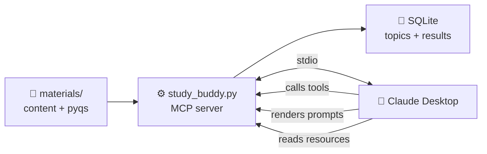

<div align="center">


# Study Buddy

**Turn your notes and past papers into a focused, local AI study system.**

An MCP server that gives Claude structured access to your study material — so it can teach, quiz, and drill you on your own content, and remember how you did.

[](https://python.org)
[](https://modelcontextprotocol.io)
[](https://docs.astral.sh/uv/)
[](https://sqlite.org)
[](LICENSE)

[**Quick Start**](#-quick-start) · [**How it Works**](#-how-it-works) · [**Tools & Prompts**](#-tools) · [**Extend**](#-extend)

</div>

---

## ✨ Why Study Buddy

LLMs can reason. They can't reach into your world — your notes, your past papers, your progress.

Study Buddy closes that gap with the **Model Context Protocol (MCP)**. You drop material into two folders. Your MCP client (Claude Desktop, Cursor, anything MCP-compatible) can now:

<table>
<tr>
<td width="33%" valign="top">

### 📚 Learn
Teach any topic from **your material**, in any style you ask for — Feynman, Socratic, exam-cram, ELI5, or anything else.

</td>
<td width="33%" valign="top">

### 🧠 Practice
Grounded quizzes from your notes. **PYQ-pattern practice**: real past questions verbatim, or new questions in that exact style.

</td>
<td width="33%" valign="top">

### 📈 Track
Local SQLite tracks mastery per topic across sessions. Weakest topics surface first. Archive what you've mastered.

</td>
</tr>
</table>

Built to also serve as a **complete reference for the MCP protocol** — every primitive, exercised with production-shaped code.

---

## ⚡ Quick Start

```bash
# 1. Clone
git clone https://github.com/eshitakundu/study-buddy.git
cd study-buddy

# 2. Install
uv sync

# 3. Drop notes into materials/content/ and past papers into materials/pyqs/

# 4. Verify the server with the MCP Inspector
uv run mcp dev study_buddy.py
```

Then [connect it to Claude Desktop](#-connect-to-claude-desktop) and start a chat:

> *"Discover topics in my materials, register the real ones, then quiz me on the weakest one."*

---

## 🧬 How it Works



### The three MCP primitives, doing real work

| Primitive | Role in Study Buddy | Examples |
|:---|:---|:---|
| 🔧 **Tools** | Actions the model invokes | `search_content`, `log_result`, `extract_pyq_style` |
| 📖 **Resources** | Browsable, URI-addressed context | `study://topics`, `study://content` |
| 💬 **Prompts** | Parameterized study workflows | `study`, `quiz`, `pyq_test` |

Plus **typed inputs** via Pydantic `Field`, **persistent state** via SQLite, and **path-traversal-safe** file access.

---

## 📁 Project Structure

```
study-buddy/
├── 📦 study_buddy.py         ← the entire server, one file
├── 🗄️  study.db              ← auto-created SQLite tracker
├── 📚 materials/
│   ├── content/            ← notes, slides, textbook extracts
│   ├── pyqs/               ← previous-year question papers
│   └── archive/            ← files you've moved aside
├── 🖼️  assets/banner.png
├── pyproject.toml
├── uv.lock
└── README.md
```

Subfolders and `study.db` are auto-created on first run.

---

## 📥 Setup

<details open>
<summary><b>Requirements</b></summary>

- **Python 3.10+**
- **[uv](https://docs.astral.sh/uv/)** — fast Python package manager
- **MCP-compatible client** — Claude Desktop, Cursor, Cline, etc.
- **Node.js** — only for the MCP Inspector via `mcp dev`

Pinned dependencies:
- `mcp[cli]>=1.27,<2` — the `<2` bound matters; SDK v2 changes import paths
- `pypdf`
- `python-docx`

</details>

<details open>
<summary><b>Install</b></summary>

```bash
git clone https://github.com/eshitakundu/study-buddy.git
cd study-buddy
uv sync
```

</details>

<details>
<summary><b>Add your study material</b></summary>

**Notes** (`materials/content/`):
```
dbms-notes.md
transactions.pdf
normalization-slides.docx
er-diagram.png
```

**Past papers** (`materials/pyqs/`):
```
dbms-midterm-2024.pdf
dbms-final-2023.txt
operating-systems-pyq.docx
```

Files moved via `archive_files` land in `materials/archive/`.

</details>

---

## 🧪 Run and Test

```bash
uv run mcp dev study_buddy.py
```

Opens the **MCP Inspector** in your browser (via `npx`). List and call every tool, read resources, and preview rendered prompts — all before touching your client.


> ⚠️ **Gotcha:** if `node` stays alive on port 6277 after the Inspector closes, the next `mcp dev` fails with *Proxy Server PORT IS IN USE*. Fix on Windows:
> ```powershell
> Get-Process node | Stop-Process -Force
> ```

---

## 🔌 Connect to Claude Desktop

Config file:
- **Windows** → `%APPDATA%\Claude\claude_desktop_config.json`
- **macOS** → `~/Library/Application Support/Claude/claude_desktop_config.json`

```json
{
  "mcpServers": {
    "study-buddy": {
      "command": "C:\\Users\\<you>\\.local\\bin\\uv.exe",
      "args": [
        "--directory",
        "C:\\Users\\<you>\\path\\to\\study-buddy",
        "run",
        "study_buddy.py"
      ]
    }
  }
}
```

> 🔑 **Three things that trip everyone up:**
> 1. Use **absolute paths** — Claude Desktop's working directory isn't your project folder.
> 2. On Windows, escape backslashes as `\\`.
> 3. **Fully quit** Claude Desktop from the system tray before reopening. Closing the window isn't enough.

Debug logs → `%APPDATA%\Claude\logs\mcp-server-study-buddy.log`


---

## 🔧 Tools

<details open>
<summary><b>📚 Material</b></summary>

| Tool | Purpose |
|:---|:---|
| `list_content` | List files in `materials/content/` |
| `list_pyqs` | List files in `materials/pyqs/` |
| `read_file` | Read a file from `content`, `pyqs`, or `archive` |
| `search_content` | Substring search across content files |
| `archive_files` | Physically move files into `materials/archive/` |

</details>

<details open>
<summary><b>🎯 Topics & Progress</b></summary>

| Tool | Purpose |
|:---|:---|
| `discover_topics` | Rank candidate topics from headings, bold text, question stems |
| `register_topic` | Add a topic to the tracker |
| `list_topics` | Active topics with attempts, mastery %, last-attempt time |
| `archive_topic` | Mark a topic as mastered (metadata only) |
| `log_result` | Record a quiz score against a registered topic |
| `weakest_topics` | Lowest-mastery active topics |

</details>

<details open>
<summary><b>📋 PYQ Analysis</b></summary>

| Tool | Purpose |
|:---|:---|
| `extract_pyq_style` | Structural profile: types, marks, stems, samples |
| `extract_pyq_questions` | Parsed list of actual questions from a past paper |

</details>

---

## 📖 Resources

| URI | Content |
|:---|:---|
| `study://content` | Markdown index of `materials/content/` |
| `study://pyqs` | Markdown index of `materials/pyqs/` |
| `study://topics` | Mastery tracker — active + archived |

> 💡 **Important:** in Claude Desktop, resources are **user-attached**, not auto-fetched. Tools are model-initiated. Design accordingly.

---

## 💬 Prompts

<table>
<tr>
<td width="50%" valign="top">

### 🎓 `study`
Teach a topic from your content in any style.
```
topic:  normalization
style:  feynman
```
**Styles:** `default`, `feynman`, `socratic`, `eli5`, `summary`, `exam-cram` — or anything else the model can interpret.

</td>
<td width="50%" valign="top">

### 🏫 `study_all`
Walk through every active registered topic.
```
style:  default
order:  weakest_first | registered
```

</td>
</tr>
<tr>
<td width="50%" valign="top">

### 📝 `quiz`
Grounded quiz drawn only from your content. One question at a time. Results logged automatically.
```
topic:  functional dependencies
n:      5
```

</td>
<td width="50%" valign="top">

### 🎯 `pyq_test`
Real past questions or new ones matching the paper's style.
```
topic:  normalization
mode:   ask | verbatim | style
n:      5
```

</td>
</tr>
</table>

---

## 🛡️ Safety

- All file access confined to `materials/content/`, `materials/pyqs/`, `materials/archive/`
- Paths validated via `Path.is_relative_to` — blocks `../../.env` traversal
- Topic strings normalized and fuzzy-matched against registered rows — no silent row creation
- Every input bound (`n`, `days`, `max_results`) enforced via Pydantic `Field` metadata

---

## 📄 Supported Files

| Type | Extensions | Handling |
|:---|:---|:---|
| **Text** | `.txt`, `.md` | Direct read |
| **PDF** | `.pdf` | `pypdf` text extraction |
| **Word** | `.docx` | `python-docx` extraction |
| **Image** | `.png`, `.jpg`, `.jpeg`, `.webp` | Returned as MCP `ImageContent` — vision-capable clients read it directly |

> ⚠️ **Scanned PDFs** have no extractable text. `pypdf` returns empty. OCR (Tesseract) or a text-based version before dropping in.

---

## 🎬 Example Session

```
1. Discover topics from my material.
2. Register normalization and functional dependencies.
3. Teach me normalization in exam-cram style.
4. Quiz me on normalization with 5 questions.
5. Show my weakest topics.
6. Give me a PYQ-style test on functional dependencies.
```

The client chains discovery → registration → retrieval → quiz → logging, all against your own material.

---

## 🚀 Extend

Same MCP scaffolding, different domain:

<table>
<tr>
<td>📄 Research-paper assistant</td>
<td>📚 Local docs navigator</td>
<td>🧑‍💻 Codebase explainer</td>
</tr>
<tr>
<td>💼 Job-application tracker</td>
<td>💰 Personal finance coach</td>
<td>🍳 Recipe & meal planner</td>
</tr>
</table>

The recipe:
```
safe data access
+ tools           (actions)
+ resources       (browsable context)
+ prompts         (workflows)
+ persistent state (SQLite)
= a practical MCP server
```

---

## 🛠️ Built With

<div align="center">

[](https://python.org)
[](https://github.com/modelcontextprotocol/python-sdk)
[](https://pydantic.dev)
[](https://sqlite.org)
[](https://docs.astral.sh/uv/)

</div>

- **[Official MCP Python SDK](https://github.com/modelcontextprotocol/python-sdk)** — `mcp[cli]` with FastMCP
- **SQLite** — persistent state (stdlib)
- **Pydantic** — typed inputs (via the SDK)
- **`pypdf`**, **`python-docx`** — file extraction
- **`uv`** — dependency management

---

## 📜 License

MIT © [Eshita Kundu](https://github.com/eshitakundu) — see [LICENSE](LICENSE).

---

<div align="center">

**Built for the [Codédex Monthly Challenge — June 2026](https://www.codedex.io/community/monthly-challenge)**

⭐ Star if this taught you something · 🐛 [Issues](https://github.com/eshitakundu/study-buddy/issues) · 💬 [Discussions](https://github.com/eshitakundu/study-buddy/discussions)

</div>