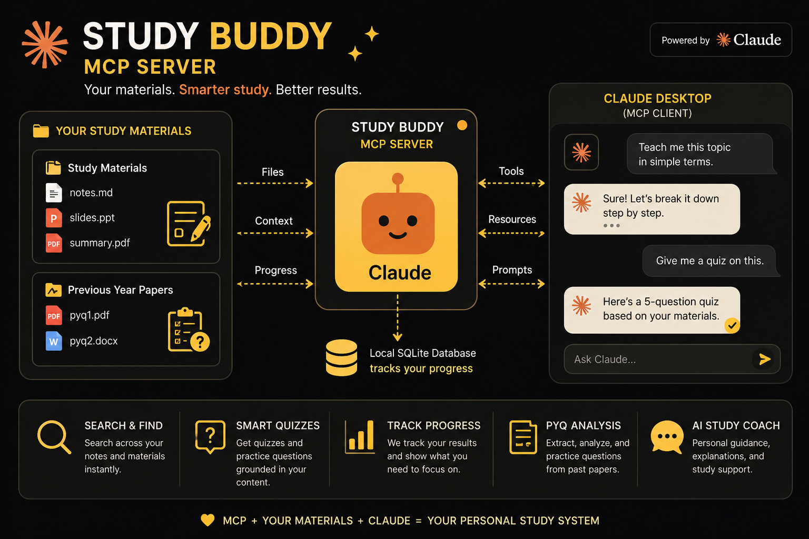
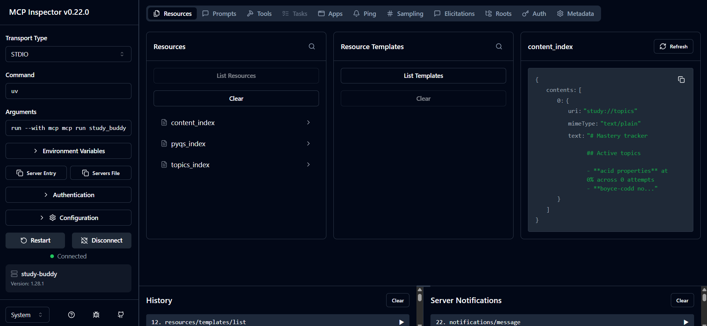
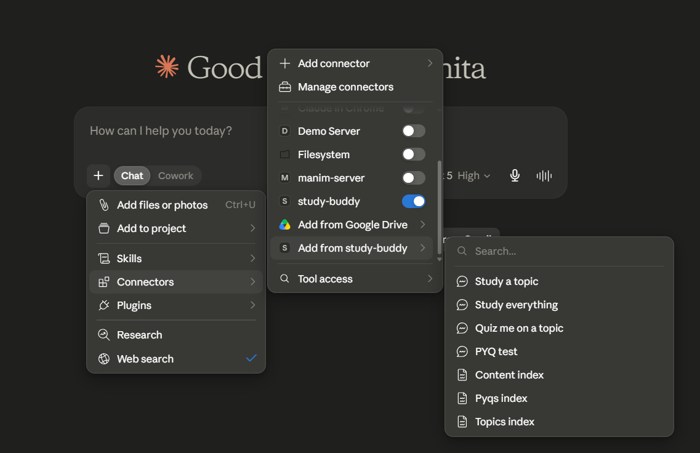
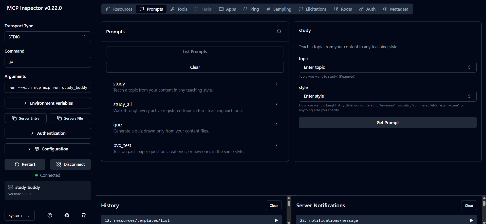
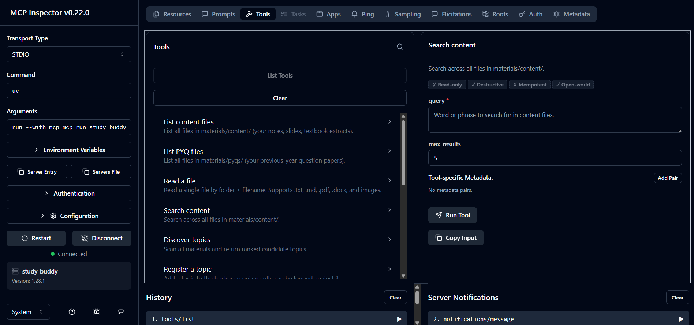
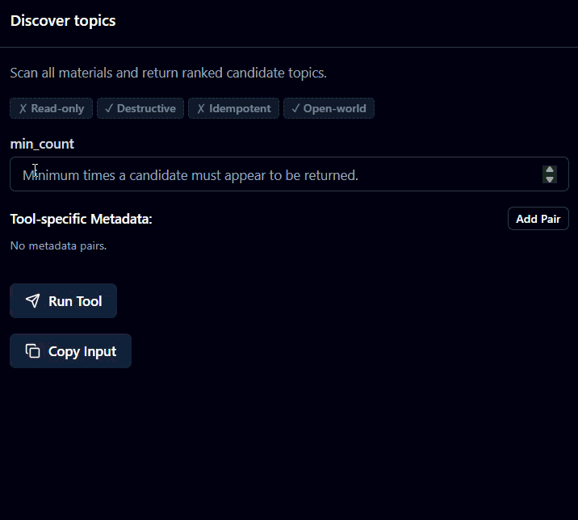
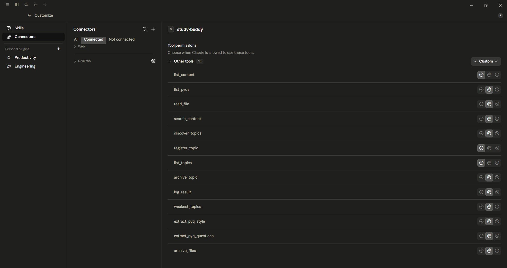

# Build Your Own MCP Server with Python and Claude



*Part of the [Study Buddy](README.md) MCP server project.*


[](https://python.org)
[](https://modelcontextprotocol.io)
[](https://claude.ai/download)

<details>
<summary><b>📋 Table of contents</b></summary>

**Setup**
* [What are we building?](#what-are-we-building)
* [What is MCP?](#what-is-mcp)
* [What Study Buddy can do](#what-study-buddy-can-do)
* [Before we start](#before-we-start)
* [The final architecture](#the-final-architecture)

**Build**
* [Step 1: Create the server foundation](#step-1-create-the-server-foundation)
* [Step 2: Safe file access](#step-2-safe-file-access)
* [Step 3: Reading different types of study material](#step-3-reading-different-types-of-study-material)
* [Step 4: Tools](#step-4-tools)
* [Step 5: Search content without dumping every file into the chat](#step-5-search-content-without-dumping-every-file-into-the-chat)
* [Step 6: Give Study Buddy memory with SQLite](#step-6-give-study-buddy-memory-with-sqlite)
* [Step 7: Register topics and log results](#step-7-register-topics-and-log-results)
* [Step 8: Show progress, archive what you've mastered, and find weak topics](#step-8-show-progress-archive-what-youve-mastered-and-find-weak-topics)
* [Step 9: Discover topics from study material](#step-9-discover-topics-from-study-material)
* [Step 10: Analyse previous-year question papers](#step-10-analyse-previous-year-question-papers)
* [Step 11: Clean up with archive_files](#step-11-clean-up-with-archive_files)
* [Step 12: Resources](#step-12-resources)
* [Step 13: Prompts](#step-13-prompts)
* [Wire up the entry point](#wire-up-the-entry-point)
* [Step 14: Start the server in MCP Inspector](#step-14-start-the-server-in-mcp-inspector)
* [Step 15: Connect Study Buddy to Claude Desktop](#step-15-connect-study-buddy-to-claude-desktop)

**Wrap-up**
* [Try it](#try-it)
* [What this project taught us](#what-this-project-taught-us)
* [Where to take it next](#where-to-take-it-next)
* [Source code](#source-code)

</details>

## What are we building?

If you study with Claude, you've probably done this: paste your notes into a chat, explain what they mean, get quizzed, close the tab, and start from zero again tomorrow. Claude never remembers which topics you're weak on. It's never seen your past papers. Every session, you're re-teaching it your own material.

That's the gap MCP closes.

Most people first hear about MCP through a sentence like, "It lets AI use tools." That's technically true, but it doesn't really explain why you'd care.

So instead of building a random weather tool or a one-line demo server, we're building something I actually use.

We're building Study Buddy, a local MCP server that gives Claude Desktop access to your own study material.

You drop notes, slides, PDFs, textbook extracts, and past papers into a few folders. Claude can then search through them, explain a topic in a style you choose, quiz you using your actual material, analyse the pattern of your past papers, and remember which topics you keep getting wrong.

I built the first version of this over a weekend of DBMS exam prep, because I ran into exactly this problem: a chatbot with no memory, no idea what my past papers looked like, and no sense of which topics I kept failing on. Study Buddy fixes all three, and it's grounded only in files I actually own.

The project is useful on its own, but the bigger goal is understanding how MCP actually works.

By the end, you should be able to look at any idea and think:

"I could build an MCP server for that."

Study Buddy is built with Python, FastMCP, SQLite, `pypdf`, and `python-docx`. No external services, no API keys, nothing leaves your machine.

---

## What is MCP?

MCP stands for Model Context Protocol.

Think of it as a common language between an AI application and a program you write.

Claude Desktop is the AI application in this project. It's called the client.

Study Buddy is the Python program we build. It's called the server.

Claude Desktop can connect to Study Buddy and ask it to do specific things. Study Buddy decides what Claude is allowed to access, what actions it can take, and what information it can remember.

Without MCP, you might manually upload a PDF, paste notes into a chat, explain what the file means, and repeat that every single time.

With MCP, you build a small local system that already knows where your notes live and what it's allowed to do with them.

> Worth internalizing early: the server is not "Claude with extra steps." Claude cannot see your filesystem. It can only call the functions you expose, with the arguments you defined, and it only gets back what your code chooses to return. That boundary is the entire point.

* **Claude Desktop** is the MCP client. It talks to the server and uses its capabilities.
* **Study Buddy** is the MCP server. It exposes safe, specific functionality.
* **Tools** are actions Claude can call.
* **Resources** are pieces of context a user can attach or browse.
* **Prompts** are reusable workflows that start a structured interaction.
* **SQLite** stores progress so the server remembers something after the current chat ends.

That's the whole idea.

Your data stays local. The server exposes only the things you choose. Claude gets useful context and actions without being handed unrestricted access to your computer.

---

## What Study Buddy can do

Every row below is a real function you'll build and wire up over the next 15 steps, not a marketing bullet:

| Capability | Powered by |
|:---|:---|
| Read notes, Markdown, PDFs, Word docs, and images | `read_file` |
| Search your course content for a topic | `search_content` |
| Discover likely topics from your material automatically | `discover_topics` |
| Register topics and log quiz scores against them | `register_topic`, `log_result` |
| Surface your weakest topics, archive the ones you've mastered | `weakest_topics`, `archive_topic` |
| Analyse question patterns in past papers (types, marks, common stems) | `extract_pyq_style` |
| Pull out actual previous-year questions verbatim | `extract_pyq_questions` |
| Teach a topic in any style: Feynman, Socratic, ELI5, exam-cram, or your own | `study` |
| Walk through every registered topic in one sitting, weakest first | `study_all` |
| Tidy up by moving files you're done with into an archive folder | `archive_files` |
| Remember every quiz attempt across sessions | SQLite (`study.db`) |

---

## Before we start

| Requirement | Why |
|:---|:---|
| Python 3.10+ | Runtime. `Annotated` types and `str \| None` union syntax need 3.10+. |
| [`uv`](https://docs.astral.sh/uv/) | Installs dependencies and runs the server; no separate `pip`/`venv` dance. |
| Claude Desktop | The MCP client you'll connect Study Buddy to. |
| Node.js | Only for the MCP Inspector: `mcp dev` shells out to `npx`. |
| Basic Python | Functions, decorators, imports, type hints. You'll see all of these below. |

I used Python 3.12 and pinned the MCP SDK below version 2 because the SDK is evolving quickly and version 2 changes some imports.

```bash
uv init
uv add "mcp[cli]>=1.27,<2" pypdf python-docx
```

If you already created the project folder, run `uv init` inside it. Do not add a project name after the command.

Following these steps, your folder will look like this:

```text
study-buddy/
├── materials/
│   ├── content/
│   ├── pyqs/
│   └── archive/
├── study_buddy.py
├── study.db          ← appears after Step 6, first time you run the server
├── pyproject.toml
└── uv.lock
```

That's the whole project. `README.md`, `LICENSE`, and the `assets/` folder in my own repo are there because I published it, not because the server needs them: skip them entirely if you're just building this for yourself.

The `materials` folder is where the user puts their study material.

`content` is for notes, slides, textbook extracts, and other things you want Claude to teach from.

`pyqs` is for previous-year papers or mock papers.

`archive` is for files you no longer want included in active study sessions.

Here's what mine looked like once I dropped my own DBMS notes and past papers in:


---

## The final architecture

Before writing code, here is the whole system in one picture:

```text
Your notes and past papers
          ↓
materials/content + materials/pyqs
          ↓
Study Buddy MCP server
          ↓
Claude Desktop
          ↓
Teaching, quizzes, PYQ practice, progress tracking
```

The server sits in the middle.

It reads files from approved folders, stores progress in SQLite, and gives Claude a set of tools, resources, and prompts.

Claude does not directly crawl through your computer. It asks the server to do specific things.

That distinction matters.

---

## Step 1: Create the server foundation

Create a file named `study_buddy.py`.

Start with these imports:

```python
import difflib
import re
import shutil
import sqlite3
from pathlib import Path
from typing import Annotated

from pydantic import Field

from mcp.server.fastmcp import FastMCP, Image
from mcp.server.fastmcp.prompts import base
```

There are a few things happening here.

`FastMCP` is the main class that lets us create an MCP server using normal Python functions.

`Image` lets a tool return image content instead of plain text. This is useful for handwritten notes, diagrams, screenshots, and other visual study material.

`Annotated` and `Field` let us describe tool inputs properly. That means Claude Desktop can show useful labels such as "How many questions?" instead of a vague parameter name like `n`.

`shutil` doesn't get used until much later, when we build the tool that physically moves files into an archive folder. I'm importing it here, at the top, because that's where imports belong, not because it does anything yet.

Now create the server and project paths.

```python
mcp = FastMCP("study-buddy")

ROOT = Path(__file__).parent
MATERIALS_DIR = ROOT / "materials"
CONTENT_DIR = MATERIALS_DIR / "content"
PYQS_DIR = MATERIALS_DIR / "pyqs"
ARCHIVE_DIR = MATERIALS_DIR / "archive"
DB_PATH = ROOT / "study.db"

for d in (CONTENT_DIR, PYQS_DIR, ARCHIVE_DIR):
    d.mkdir(parents=True, exist_ok=True)
```

`FastMCP("study-buddy")` creates our server.

The name is what Claude Desktop will see when it connects.

The folder code is here so the project works on a fresh clone. If someone downloads the repository and runs it, they shouldn't have to manually create three empty folders before anything starts.

`mkdir(parents=True, exist_ok=True)` means:

* Create the folder if it doesn't exist
* Create missing parent folders too
* Don't crash if the folder already exists

That small choice makes the server easier to use.

---

## Step 2: Safe file access

The most important rule in this project is simple:

Claude should be able to access study material, not everything on the computer.

We create a list of approved folders.

```python
TEXT_EXTS = {".txt", ".md"}
IMAGE_EXTS = {".png", ".jpg", ".jpeg", ".webp"}
VALID_FOLDERS = {"content", "pyqs", "archive"}
```

Then we create two helper functions.

```python
def _folder_path(folder: str) -> Path:
    if folder not in VALID_FOLDERS:
        raise ValueError(f"folder must be one of {sorted(VALID_FOLDERS)}.")
    return MATERIALS_DIR / folder


def _safe_path(folder: str, name: str) -> Path:
    base_dir = _folder_path(folder)
    path = (base_dir / name).resolve()
    if not path.is_relative_to(base_dir.resolve()):
        raise ValueError("Access outside the materials folder is not allowed.")
    return path
```

This is one of the places where MCP becomes more than "give Claude access to files."

A careless version of this project might accept any filename and do this:

```python
Path(name).read_text()
```

That looks harmless until someone (or some model, hallucinating a plausible-looking argument) passes something like:

`../../.env`

or:

`C:\Users\your-name\Documents\private-file.txt`

Our `_safe_path()` function resolves the requested path first, then checks that the final path is still inside an approved folder.

`.resolve()` is doing the real work here: it collapses `..` segments and symlinks down to an absolute path *before* we compare it against the folder boundary. If you skip that step and compare the raw string instead, `content/../../../etc/passwd` will slide right past a naive check because the traversal hasn't been resolved yet.

If the resolved path isn't inside the approved folder, the server rejects it.

This is the general MCP idea:

Don't expose your whole computer. Expose a small, useful boundary.

---

## Step 3: Reading different types of study material

Students don't keep everything in one file format.

Some notes are Markdown. Some are PDFs. Some are Word files. Some are screenshots or handwritten pages.

So Study Buddy needs one helper that can extract text from supported files.

```python
def _extract_text(path: Path) -> str | None:
    # cached by (path, mtime) so repeated reads of the same file do not re-parse
    if not path.exists() or not path.is_file():
        return None
    ext = path.suffix.lower()
    if ext in IMAGE_EXTS:
        return None
    key = (str(path), path.stat().st_mtime)
    if key in _text_cache:
        return _text_cache[key]
    if ext in TEXT_EXTS:
        text = path.read_text(encoding="utf-8", errors="ignore")
    elif ext == ".pdf":
        from pypdf import PdfReader
        text = "\n".join((page.extract_text() or "") for page in PdfReader(str(path)).pages)
    elif ext == ".docx":
        from docx import Document
        text = "\n".join(p.text for p in Document(str(path)).paragraphs)
    else:
        return None
    _text_cache[key] = text
    return text
```

Put the cache dictionary right above it, before the function:

```python
_text_cache: dict[tuple[str, float], str] = {}
```

There are three useful ideas here.

* Text and Markdown files can be read directly.
* PDFs need `pypdf`.
* Word documents need `python-docx`.

The cache is also important.

Searching through a folder means repeatedly reading files. Parsing the same PDF every time Claude searches for a topic would get slow quickly.

The cache key is `(path, mtime)`: the file path plus its last-modified timestamp.

If the file hasn't changed, Study Buddy returns the already-extracted text. If the file changes, the modification time changes too, so the key no longer matches and the server re-extracts.

That's a cheap, correct cache with zero invalidation logic to maintain: the filesystem does the invalidation for you. It's worth remembering this pattern; `(path, mtime)` as a cache key shows up constantly in build tools, static site generators, and dev servers for exactly this reason.

Note also that `pypdf` and `python-docx` are imported *inside* the branches that need them, not at the top of the file. That keeps the module import fast for people who only ever touch Markdown notes, and it means a missing optional dependency only breaks the code path that actually needs it.

---

## Step 4: Tools

Tools are actions Claude can call.

A tool is just a Python function with the `@mcp.tool()` decorator.

For Study Buddy, the first useful tools are:

* List files
* Read a file
* Search notes

Start with a helper that lists files in one folder.

```python
def _list_folder(folder: str) -> list[dict]:
    items = []
    for p in sorted(_folder_path(folder).iterdir()):
        if p.is_file():
            items.append({
                "name": p.name,
                "type": p.suffix.lower().lstrip("."),
                "size_kb": round(p.stat().st_size / 1024, 1),
            })
    return items
```

Now expose it to Claude.

```python
@mcp.tool(title="List content files")
def list_content():
    """List all files in materials/content/ (your notes, slides, textbook extracts)."""
    return _list_folder("content")


@mcp.tool(title="List PYQ files")
def list_pyqs():
    """List all files in materials/pyqs/ (your previous-year question papers)."""
    return _list_folder("pyqs")
```

The decorator makes the function visible to an MCP client.

The docstring matters too.

Claude uses tool names, descriptions, parameter names, and schemas to decide which tool is useful for a request. This isn't cosmetic: the docstring and the `title=` string are literally what gets sent to the model as the tool's definition. A vague tool description creates vague tool use, the same way a vague function name confuses the next engineer who reads your code.

Now add file reading.

```python
@mcp.tool(title="Read a file")
def read_file(
    folder: Annotated[str, Field(description="Which folder: 'content', 'pyqs', or 'archive'.")],
    name: Annotated[str, Field(description="Filename inside that folder.")],
):
    """Read a single file by folder + filename. Supports .txt, .md, .pdf, .docx, and images."""
    path = _safe_path(folder, name)
    if not path.exists():
        return f"No file named '{name}' in materials/{folder}/."
    if path.suffix.lower() in IMAGE_EXTS:
        return Image(path=str(path))
    text = _extract_text(path)
    if text is None:
        return f"Unsupported file type: {path.suffix}"
    return text.strip() or "(No extractable text. This may be a scanned PDF.)"
```

Notice that image files are handled differently.

A PDF or Markdown file becomes text.

An image becomes an MCP `Image` object.

That means Claude can use its own vision ability to inspect diagrams, screenshots, handwritten notes, and images. No OCR setup is required for normal image files.

Scanned PDFs are different. A scanned PDF often contains a picture of text rather than actual text. `pypdf` can't reliably extract that: it returns an empty string, and `_extract_text` returns `None`. If you drop a scanned PDF into `materials/content/`, `read_file` will tell you as much instead of failing silently. Fix it with OCR (Tesseract) or a text-based version of the material.

---

## Step 5: Search content without dumping every file into the chat

We don't want Claude to read every file in a folder just because someone asks about one topic.

That wastes context and gets slow.

Instead, Study Buddy searches content files and returns small snippets first.

```python
@mcp.tool(title="Search content")
def search_content(
    query: Annotated[str, Field(description="Word or phrase to search for in content files.")],
    max_results: Annotated[int, Field(description="Maximum number of matching files to return.", ge=1, le=20)] = 5,
):
    """Search across all files in materials/content/."""
    q = query.lower().strip()
    if not q:
        return []
    hits = []
    for p in sorted(CONTENT_DIR.iterdir()):
        if not p.is_file():
            continue
        text = _extract_text(p)
        if not text:
            continue
        idx = text.lower().find(q)
        if idx == -1:
            continue
        start = max(0, idx - 60)
        end = min(len(text), idx + len(q) + 60)
        snippet = text[start:end].replace("\n", " ").strip()
        hits.append({"name": p.name, "snippet": f"...{snippet}..."})
        if len(hits) >= max_results:
            break
    return hits
```

This tool returns filenames and small excerpts instead of entire documents. Then Claude decides which file is worth reading in full.

For example:

```text
User: Teach me this topic in simple terms.

Claude:
1. Searches the content folder
2. Finds matching files
3. Reads only the useful files
4. Explains the topic based on those files
```

That's a good MCP pattern in general, not just for this project: return the minimum useful information first, and let the model retrieve more detail only when it actually needs it. If you've worked with retrieval-augmented generation before, this is the same instinct: search returns candidates, a second call fetches the full content only for the candidates worth reading.

One limitation worth flagging honestly: `search_content` does a plain substring match on lowercased text, not a fuzzy or semantic search. Search for "normalisation" and it won't find "normalization." That's a deliberate simplicity trade-off for a local, dependency-light project. See "Where to take it next" for how you'd upgrade it.

---

## Step 6: Give Study Buddy memory with SQLite

At this point, Study Buddy can search and read study material. But it has no memory.

If you score 2 out of 5 on a quiz today, then start a new chat tomorrow, the server would know nothing about it. That's where SQLite comes in.

SQLite is a small local database stored in a single file. Study Buddy creates a file called `study.db` beside the server file.

```python
def _db():
    conn = sqlite3.connect(DB_PATH)
    conn.row_factory = sqlite3.Row
    return conn


def _init_db():
    with _db() as conn:
        conn.execute("""
            CREATE TABLE IF NOT EXISTS topics (
                id INTEGER PRIMARY KEY AUTOINCREMENT,
                name TEXT UNIQUE NOT NULL,
                archived INTEGER NOT NULL DEFAULT 0,
                created_at TEXT NOT NULL DEFAULT (datetime('now'))
            )
        """)
        conn.execute("""
            CREATE TABLE IF NOT EXISTS results (
                id INTEGER PRIMARY KEY AUTOINCREMENT,
                topic_id INTEGER NOT NULL REFERENCES topics(id),
                score INTEGER NOT NULL,
                total INTEGER NOT NULL,
                created_at TEXT NOT NULL DEFAULT (datetime('now'))
            )
        """)


_init_db()
```

`conn.row_factory = sqlite3.Row` is a small detail worth calling out: it lets you index result rows by column name (`row["name"]`) instead of by position (`row[0]`). Skip this line and every query below has to track column order by hand, a classic source of "works until someone reorders a SELECT" bugs.

We use two tables. `topics` stores each tracked topic once. `results` stores every quiz attempt. This gives us a one-to-many relationship:

```text
One topic
   ↓
Many quiz attempts
```

Why not just save the topic name inside every quiz result? Because users are messy. Someone might type:

* Normalization
* normalization
* normalisation
* database normalization
* normalisation topic

Those might all mean the same thing, but a database would treat them as separate values unless we normalize first.

```python
def _normalize_topic(name: str) -> str:
    return re.sub(r"\s+", " ", name.strip().lower())
```

We also use fuzzy matching so small typos or spelling variants don't fracture the tracker into duplicate rows.

```python
def _registered_topics() -> list[str]:
    with _db() as conn:
        return [r["name"] for r in conn.execute("SELECT name FROM topics").fetchall()]


def _match_topic(name: str) -> str | None:
    # exact match first, then fuzzy fallback so 'loops' matches 'loop', etc.
    target = _normalize_topic(name)
    registered = _registered_topics()
    if target in registered:
        return target
    close = difflib.get_close_matches(target, registered, n=1, cutoff=0.7)
    return close[0] if close else None
```

`difflib.get_close_matches` is standard library: no fuzzy-matching dependency needed. `cutoff=0.7` means "at least 70% similar" using a ratio based on matching character sequences (it's the same algorithm behind `diff`-style tools). Tune it lower and you'll start matching things that aren't actually the same topic; tune it higher and typos stop being forgiven. 0.7 is a reasonable default for short topic names.

---

## Step 7: Register topics and log results

```python
@mcp.tool(title="Register a topic")
def register_topic(
    name: Annotated[str, Field(description="Topic name to add to the tracker.")],
):
    """Add a topic to the tracker so quiz results can be logged against it."""
    norm = _normalize_topic(name)
    if not norm:
        return "Topic name cannot be empty."
    with _db() as conn:
        try:
            conn.execute("INSERT INTO topics (name) VALUES (?)", (norm,))
            return f"Registered topic: {norm}"
        except sqlite3.IntegrityError:
            return f"Topic '{norm}' is already registered."
```

Notice the parameterized query: `(?)` with the value passed separately, not an f-string glued into the SQL. This is the standard defense against SQL injection, and it matters here for the same reason path traversal mattered in Step 2: an LLM-driven client can pass arbitrary strings as arguments, so every boundary where user-controlled text meets a query or a filesystem call needs to be built defensively, not just for "well-behaved" input.

The `UNIQUE` constraint on `topics.name` does the real duplicate-prevention work; the `try`/`except sqlite3.IntegrityError` just turns a database-level constraint violation into a friendly message instead of a stack trace.

Now we can record results.

```python
@mcp.tool(title="Log a quiz result")
def log_result(
    topic: Annotated[str, Field(description="Topic the quiz covered. Must be a registered topic.")],
    score: Annotated[int, Field(description="Number of questions you got right.", ge=0)],
    total: Annotated[int, Field(description="Total number of questions in the quiz.", ge=1)],
):
    """Record a quiz or test result against a registered topic."""
    if score > total:
        return f"Score must be between 0 and {total}."
    matched = _match_topic(topic)
    if not matched:
        return (
            f"No registered topic matches '{topic}'. "
            f"Call register_topic first, or use discover_topics to find one."
        )
    with _db() as conn:
        row = conn.execute("SELECT id FROM topics WHERE name = ?", (matched,)).fetchone()
        conn.execute(
            "INSERT INTO results (topic_id, score, total) VALUES (?, ?, ?)",
            (row["id"], score, total),
        )
    pct = round(100 * score / total)
    return f"Logged: {matched} -> {score}/{total} ({pct}%)."
```

The validation here isn't optional.

Claude is good at using tools, but it can still pass a bad argument. Without the `score > total` check, the server might save nonsense like 99 correct answers out of 5 questions: a mastery score of 1980%, funny once and useless forever.

Notice too that `log_result` doesn't fail hard when the topic isn't registered: it returns a message telling Claude exactly what to call next (`register_topic`, or `discover_topics` to find the right name). That's deliberate. A good MCP tool doesn't just reject bad input; it rejects it with enough information that the *model* can recover without the human having to step in. You're not just writing error handling for yourself anymore: you're writing it for an agent that will read the message and act on it.

---

## Step 8: Show progress, archive what you've mastered, and find weak topics

```python
@mcp.tool(title="List topics")
def list_topics(
    include_archived: Annotated[bool, Field(description="Include archived (mastered) topics in the result.")] = False,
):
    """List every registered topic with attempts, mastery %, and archived status."""
    with _db() as conn:
        where = "" if include_archived else "WHERE t.archived = 0"
        rows = conn.execute(f"""
            SELECT t.name,
                   t.archived,
                   COUNT(r.id) AS attempts,
                   COALESCE(SUM(r.score), 0) AS total_score,
                   COALESCE(SUM(r.total), 0) AS total_questions,
                   MAX(r.created_at) AS last_attempt
            FROM topics t
            LEFT JOIN results r ON r.topic_id = t.id
            {where}
            GROUP BY t.id
            ORDER BY t.archived ASC, last_attempt DESC NULLS LAST, t.name ASC
        """).fetchall()
    out = []
    for r in rows:
        tq = r["total_questions"]
        out.append({
            "topic": r["name"],
            "attempts": r["attempts"],
            "mastery_pct": round(100 * r["total_score"] / tq) if tq else 0,
            "last_attempt": r["last_attempt"],
            "archived": bool(r["archived"]),
        })
    return out
```

A couple of details worth slowing down on.

The `LEFT JOIN` is what lets a freshly-registered topic with zero attempts show up at all: an inner join would silently drop it, since there's no matching row in `results` yet. `COALESCE(SUM(...), 0)` exists for the same reason: `SUM()` over zero rows returns `NULL` in SQL, not `0`, and dividing by that later would blow up.

`mastery_pct` is computed from the *cumulative* score and total across every attempt, not just the most recent one, so five quizzes at 100% followed by one bad 40% attempt still nudges the percentage down instead of overwriting it. That's a design choice: mastery here means "how you've done overall," not "how you did last time."

The `where` clause is built with an f-string, but only ever substitutes one of two hardcoded strings (`""` or `"WHERE t.archived = 0"`) that never come from user input, so this isn't the same risk as gluing a variable straight into a query. It's still worth pointing out that if you ever extend this to accept a user-supplied filter, that's the moment to switch to a parameterized query instead.

Once a topic sits comfortably above the score you're happy with, you don't want it cluttering the active list forever. That's what archiving is for: it's metadata only, the underlying quiz history and content files are untouched.

```python
@mcp.tool(title="Archive a topic")
def archive_topic(
    name: Annotated[str, Field(description="Topic name to archive (mark mastered).")],
):
    """Archive a topic so it stops showing up in the active tracker. Files are not moved."""
    matched = _match_topic(name)
    if not matched:
        return f"No registered topic matches '{name}'."
    with _db() as conn:
        conn.execute("UPDATE topics SET archived = 1 WHERE name = ?", (matched,))
    return f"Archived topic: {matched}"
```

This reuses `_match_topic` from Step 6, so "Normalisation" archives the same row as "normalization": the fuzzy matching pays off again here, not just in `log_result`.

Now the weakest-topics tool, which is what actually makes the tracker useful day to day.

```python
@mcp.tool(title="Weakest topics")
def weakest_topics(
    n: Annotated[int, Field(description="How many of the weakest topics to return.", ge=1, le=20)] = 3,
):
    """Return the n topics with the lowest mastery. Ignores archived topics."""
    rows = list_topics(include_archived=False)
    rows.sort(key=lambda r: (r["mastery_pct"], -r["attempts"]))
    return rows[:n]
```

This is where the project stops being a file-search tool and becomes a study system.

Look closely at the sort key: `(mastery_pct, -r["attempts"])`. Sorting by mastery alone would put a topic with 0 attempts (mastery defaults to 0) at the very top, tied with a topic you've genuinely bombed five times. The `-attempts` tiebreaker pushes topics you've actually *tried and struggled with* ahead of ones you simply haven't touched yet: a subtle but deliberate ordering choice.

The server handles the repeatable data work: it stores scores, calculates percentages, sorts results, and keeps history. Claude handles the flexible human work: it explains, grades natural-language answers, chooses teaching styles, and adapts its wording.

That split is useful in almost every MCP project. Let the server do deterministic work. Let the model do judgment.

---

## Step 9: Discover topics from study material

Nobody wants to type twenty topic names manually.

So Study Buddy looks for likely topics in headings, bold text, and common exam-question wording.

```python
_HEADING_RE = re.compile(r"^(?:#{1,6}\s+(.+)|([A-Z][A-Za-z0-9 ,/&-]{2,60})$)", re.MULTILINE)
_BOLD_RE = re.compile(r"\*\*([^*]{2,40})\*\*")
_STEM_RE = re.compile(
    r"(?:^|\s)(?:Define|Explain|Describe|State|Derive|Discuss|What is|What are)\s+(?:the\s+)?([A-Za-z][A-Za-z0-9 ,/&-]{2,60})",
    re.IGNORECASE,
)
```

Three regexes, three different signals: Markdown headings (`## Normalization`), bold emphasis (`**normalization**`), and question stems lifted straight from how exam papers are phrased ("Define normalization", "Explain the CAP theorem"). Real study notes tend to trip at least one of these.

Then we turn those matches into cleaner candidates.

```python
def _candidate_topics_from_text(text: str) -> list[str]:
    cands: list[str] = []
    for m in _HEADING_RE.finditer(text):
        cands.append((m.group(1) or m.group(2) or "").strip())
    cands.extend(m.group(1).strip() for m in _BOLD_RE.finditer(text))
    cands.extend(m.group(1).strip().rstrip(".?,") for m in _STEM_RE.finditer(text))
    out = []
    for c in cands:
        c = re.sub(r"\s+", " ", c).strip(" :.-")
        c = re.sub(r"^(?:a|an|the)\s+", "", c, flags=re.IGNORECASE)
        if 3 <= len(c) <= 60 and not c.isupper():
            out.append(c)
    return out
```

The `not c.isupper()` check at the end is a small but deliberate filter: it drops shouty all-caps false positives like section labels ("IMPORTANT", "NOTE") that would otherwise match the heading pattern but aren't actual topics.

Now expose it as a tool.

```python
@mcp.tool(title="Discover topics")
def discover_topics(
    min_count: Annotated[int, Field(description="Minimum times a candidate must appear to be returned.", ge=1)] = 2,
):
    """Scan all materials and return ranked candidate topics."""
    from collections import Counter
    counter: Counter[str] = Counter()
    for folder in (CONTENT_DIR, PYQS_DIR):
        for p in sorted(folder.iterdir()):
            if not p.is_file():
                continue
            text = _extract_text(p)
            if not text:
                continue
            for cand in _candidate_topics_from_text(text):
                counter[_normalize_topic(cand)] += 1
    registered = set(_registered_topics())
    return [
        {"topic": name, "count": cnt, "already_registered": name in registered}
        for name, cnt in counter.most_common(30)
        if cnt >= min_count
    ]
```

`min_count` is a noise filter. A phrase that shows up once across your entire material might just be an incidental bold word; a phrase that shows up three or four times across notes and past papers is almost certainly a real topic. Raising `min_count` trades recall for precision.

This tool doesn't claim that every result is definitely a real topic. It returns candidates. Claude can then look at the list, remove noise, merge similar concepts, and register the ones that make sense.

Again: server for repeatable extraction, model for judgment.

---

## Step 10: Analyse previous-year question papers

This is the part that makes Study Buddy more interesting than a normal note-search assistant.

Past papers aren't just a source of questions. They also reveal patterns. Does a teacher prefer short definitions? Long explanations? Numericals? Five-mark questions? "Explain" questions? "Compare" questions?

We can extract that structure.

```python
_QUESTION_SPLIT_RE = re.compile(
    r"(?m)^(?:Q\.?\s*\d+|Question\s+\d+|\d{1,2}[.)])\s*[:.\-]?\s*"
)
_MARKS_RE = re.compile(r"\[?\(?\s*(\d{1,3})\s*marks?\s*\]?\)?", re.IGNORECASE)
_MCQ_RE = re.compile(r"(?m)^\s*\(?[a-d]\)?[.\)]\s+", re.IGNORECASE)
```

`(?m)` at the start of `_QUESTION_SPLIT_RE` turns on multiline mode, so `^` matches the start of *every line*, not just the start of the whole string. Without it, this regex would only ever match a question number sitting on line one of the file.

```python
def _parse_pyq_questions(text: str) -> list[str]:
    parts = _QUESTION_SPLIT_RE.split(text)
    if len(parts) <= 1:
        parts = re.split(r"\n\s*\n", text)
    qs = []
    for part in parts:
        q = re.sub(r"\s+", " ", part).strip()
        if 10 <= len(q) <= 1000:
            qs.append(q)
    return qs
```

Notice the fallback: if splitting on question numbers produces basically nothing (`len(parts) <= 1`, meaning the pattern never matched), we fall back to splitting on blank lines instead. Not every past paper numbers its questions consistently: some are pasted from a scanned document, some use inconsistent formatting. The fallback keeps the tool useful on messier input instead of returning an empty list.

Now we can return actual questions.

```python
@mcp.tool(title="Extract PYQ questions")
def extract_pyq_questions(
    name: Annotated[str, Field(description="PYQ filename inside materials/pyqs/.")],
    max_questions: Annotated[int, Field(description="Maximum number of questions to return.", ge=1, le=100)] = 20,
):
    """Return the parsed list of actual questions from a past paper, in order."""
    path = _safe_path("pyqs", name)
    if not path.exists():
        return f"No file named '{name}' in materials/pyqs/."
    text = _extract_text(path)
    if not text:
        return []
    return _parse_pyq_questions(text)[:max_questions]
```

We can also return a structural profile: question types, mark distribution, and the most common question stems.

```python
def _classify_question(q: str) -> str:
    if _MCQ_RE.search(q):
        return "mcq"
    if re.search(r"\b(calculate|compute|find the value|solve)\b", q, re.IGNORECASE):
        return "numerical"
    if len(q) < 120:
        return "short"
    return "long"


def _stem_pattern(q: str) -> str | None:
    m = re.match(r"^\s*(Define|Explain|Describe|State|Derive|Discuss|Prove|Compare|What is|What are|Why)\b", q, re.IGNORECASE)
    return m.group(1).title() if m else None
```

```python
@mcp.tool(title="Extract PYQ style")
def extract_pyq_style(
    name: Annotated[str, Field(description="PYQ filename inside materials/pyqs/.")],
):
    """Analyze a past paper and return its structural style: question count, types, mark distribution, common stems."""
    from collections import Counter
    path = _safe_path("pyqs", name)
    if not path.exists():
        return f"No file named '{name}' in materials/pyqs/."
    text = _extract_text(path)
    if not text:
        return "Could not extract text from this file."
    questions = _parse_pyq_questions(text)
    if not questions:
        return "No questions could be parsed from this file."
    types = Counter(_classify_question(q) for q in questions)
    marks = [int(m.group(1)) for m in _MARKS_RE.finditer(text)]
    stems = Counter(s for s in (_stem_pattern(q) for q in questions) if s)
    return {
        "file": name,
        "question_count": len(questions),
        "type_breakdown": dict(types),
        "mark_distribution": sorted(marks),
        "common_stems": dict(stems.most_common(5)),
        "sample_questions": questions[:3],
    }
```

Claude can use this structure to create new questions that feel similar to the paper without copying it.

For example, it can notice that a paper contains mostly short explanation questions with a few numerical questions and a certain mark distribution, then generate a fresh practice set using your own notes: same shape, different questions.

---

## Step 11: Clean up with archive_files

Remember `shutil`, imported all the way back in Step 1 and unused ever since? This is its moment.

`archive_topic` (Step 8) only touches the database: it hides a topic from the active list but leaves every file exactly where it is. Sometimes you want the opposite: physically move files you're done with out of `content/` or `pyqs/` so they stop showing up in `list_content`, `search_content`, and `discover_topics` at all, without deleting them.

```python
@mcp.tool(title="Move files to archive")
def archive_files(
    folder: Annotated[str, Field(description="Source folder: 'content' or 'pyqs'.")],
    names: Annotated[list[str], Field(description="List of filenames to move into materials/archive/.")],
):
    """Physically move one or more files from content/ or pyqs/ into materials/archive/."""
    if folder not in {"content", "pyqs"}:
        return "Source folder must be 'content' or 'pyqs'."
    moved, missing = [], []
    for n in names:
        src = _safe_path(folder, n)
        if not src.exists():
            missing.append(n)
            continue
        dst = ARCHIVE_DIR / src.name
        shutil.move(str(src), str(dst))
        moved.append(src.name)
    return {"moved": moved, "missing": missing}
```

A few things worth noticing.

`names` is typed as `list[str]`, not `str`: this is a batch operation. Claude can move five files in a single tool call instead of five separate ones, which matters for both latency and the number of round trips through the model.

`folder` deliberately excludes `"archive"` as a valid source: you can only archive *into* `materials/archive/`, not out of it or from itself. That's enforced by the explicit `if folder not in {"content", "pyqs"}` check, which is stricter than the general `VALID_FOLDERS` set from Step 2 (that one allows `"archive"` as a valid *read* location, since `read_file` should still be able to open archived files).

It also never raises on a missing file: it collects the name into `missing` and keeps going, then reports both `moved` and `missing` in the result. That's a better shape for a batch tool: one bad filename in a list of ten shouldn't roll back the other nine. Compare this to `read_file` or `extract_pyq_style`, which operate on a single file and can afford to fail loud and immediately. The right error-handling shape depends on whether the tool is doing one thing or many.

`_safe_path` from Step 2 is still doing its job here too: you can't pass a `name` that escapes the source folder, same as with `read_file`.

---

## Step 12: Resources

So far, we've built tools. Tools are actions Claude can call.

Resources are different. A resource is context that can be read or attached.

Study Buddy exposes three useful resources:

* A content index
* A past-paper index
* A mastery tracker

```python
def _index_md(title: str, items: list[dict]) -> str:
    if not items:
        return f"# {title}\n\n*Empty. Drop files into this folder.*"
    lines = [f"# {title}\n"]
    for f in items:
        lines.append(f"- **{f['name']}** ({f['type']}, {f['size_kb']} KB)")
    return "\n".join(lines)


@mcp.resource("study://content")
def content_index():
    """Index of files in materials/content/."""
    return _index_md("Content files", _list_folder("content"))


@mcp.resource("study://pyqs")
def pyqs_index():
    """Index of files in materials/pyqs/."""
    return _index_md("PYQ files", _list_folder("pyqs"))
```

For progress, we expose the tracked topics.

```python
@mcp.resource("study://topics")
def topics_index():
    """Current mastery table: active topics, then archived."""
    active = list_topics(include_archived=False)
    archived = [t for t in list_topics(include_archived=True) if t["archived"]]
    lines = ["# Mastery tracker\n", "## Active topics\n"]
    if not active:
        lines.append("*No topics registered yet.*")
    for t in active:
        lines.append(f"- **{t['topic']}** at {t['mastery_pct']}% across {t['attempts']} attempts")
    lines.append("\n## Archived (mastered)\n")
    if not archived:
        lines.append("*None yet.*")
    for t in archived:
        lines.append(f"- {t['topic']} at {t['mastery_pct']}%")
    return "\n".join(lines)
```

Notice that resources return Markdown strings, built by reusing the exact same `list_topics()` tool function from Step 8. There's no separate database query living inside `topics_index`: it calls the tool like any other piece of Python would. Tools and resources aren't two disconnected systems; a resource is free to be a thin formatting layer on top of a tool.

Here's `study://content` reading back through the Inspector's Resources tab, next to the raw JSON envelope MCP wraps it in:



A simple way to remember the difference between the three primitives:

| | Tool | Resource | Prompt |
|:---|:---|:---|:---|
| **What it is** | An action Claude can call | Context a user can attach or browse | A reusable workflow the user triggers |
| **Who initiates it** | The model, mid-conversation | The user, from the attachment menu | The user, from the prompt picker |
| **Use it when** | Claude needs to *do* something | There's useful context to inspect | The user should start a structured workflow |
| **Study Buddy examples** | `search_content`, `log_result`, `archive_files` | `study://content`, `study://topics` | `study`, `quiz`, `pyq_test` |

One Claude Desktop quirk worth knowing before you move on: resources there are user-attached, not auto-fetched. Claude doesn't quietly read `study://topics` on its own: you (the user) have to explicitly attach it from the paperclip/attachment menu, the same way you'd attach a file. Tools, by contrast, are model-initiated: Claude decides to call them based on the conversation. If you build a resource and then wonder why Claude never seems to "notice" it, this is why.

This is that attach menu in practice. Click the **+** in the chat box, then **Add from study-buddy**, and all three resources show up ready to attach, right alongside the four prompts from Step 13:



---

## Step 13: Prompts

Prompts are reusable workflows.

Instead of typing the same long instruction every time, the user can choose a prompt from the MCP client and fill in a few fields.

Study Buddy has four:

| Prompt | Purpose | Key args |
|:---|:---|:---|
| `study` | Teach one topic, in whatever style you pick | `topic`, `style` |
| `study_all` | Walk every active topic in turn | `style`, `order` |
| `quiz` | Grounded quiz, one question at a time, auto-logged | `topic`, `n` |
| `pyq_test` | Real past questions, or new ones in that style | `topic`, `mode`, `n` |

The Inspector's Prompts tab is the fastest way to see what a prompt actually asks for before you wire it into a client: pick `study`, and it renders the `topic` and `style` fields straight from the `Field(description=...)` metadata:



```python
@mcp.prompt(title="Study a topic")
def study(
    topic: Annotated[str, Field(description="Topic you want to study.")],
    style: Annotated[str, Field(description="How you want it taught. Any style works: 'default', 'feynman', 'socratic', 'summary', 'eli5', 'exam-cram', or anything else you specify.")] = "default",
):
    """Teach a topic from your content in any teaching style."""
    return [
        base.UserMessage(
            f"Teach me **{topic}** using the **{style}** style.\n\n"
            "How to approach this:\n"
            f"- Locate the topic in my content files (use search_content or read_file as needed with folder='content').\n"
            "- Ground everything ONLY in what you read from my files. Do not invent material.\n"
            f"- Apply the '{style}' style. If it is a well-known one (feynman, socratic, eli5, summary, exam-cram) use that convention. Otherwise interpret the intent sensibly.\n"
            "- End by offering to quiz me on it."
        )
    ]
```

Notice the wording. We don't hardcode something like `Call search_content(query='topic')` inside every prompt. Why? Because a prompt is a guide, not a script. The model decides how to locate material based on the request: it might search content, read a specific file, or use context already attached by the user. That makes the workflow more flexible than a rigid, hand-authored decision tree would be.

Also notice the explicit instruction "Ground everything ONLY in what you read from my files. Do not invent material." This is a prompt doing real work against a real failure mode: without it, nothing stops the model from teaching from its own general knowledge instead of your actual notes, which defeats the entire point of grounding this in *your* material.

Here's the one genuinely new prompt: walking through every registered topic in one sitting.

```python
@mcp.prompt(title="Study everything")
def study_all(
    style: Annotated[str, Field(description="Teaching style to apply to every topic.")] = "default",
    order: Annotated[str, Field(description="'weakest_first' to prioritize low-mastery topics, or 'registered' to follow registration order.")] = "weakest_first",
):
    """Walk through every active registered topic in turn, teaching each one."""
    return [
        base.UserMessage(
            f"Teach me every active topic I have registered, one at a time, using the **{style}** style.\n\n"
            "How to approach this:\n"
            "- Call list_topics(include_archived=False) to get the active topics.\n"
            f"- If order='{order}' is 'weakest_first', sort by mastery_pct ascending; otherwise keep the returned order.\n"
            "- For each topic: search and read the relevant content files, then teach that topic in the requested style.\n"
            "- After each topic, pause and ask if I'm ready for the next one. Wait for my confirmation.\n"
            "- Skip archived topics."
        )
    ]
```

`study_all` is really just `study` run in a loop, but the loop itself is described in the prompt text rather than written as an actual Python `for` loop: the "iteration" happens across multiple turns of conversation, paced by "wait for my confirmation" so you're not buried under six topics explained back to back. That's a pattern worth remembering: not every loop belongs in code. Sometimes the loop should live in the conversation.

Here's the quiz prompt.

```python
@mcp.prompt(title="Quiz me on a topic")
def quiz(
    topic: Annotated[str, Field(description="Topic the quiz should cover.")],
    n: Annotated[int, Field(description="How many questions?", ge=1, le=50)] = 5,
):
    """Generate a quiz drawn only from your content files."""
    return [
        base.UserMessage(
            f"Quiz me on **{topic}** with {n} questions.\n\n"
            "How to approach this:\n"
            f"- Locate '{topic}' in my content files (search_content and read_file with folder='content').\n"
            f"- Generate {n} questions grounded ONLY in what you read.\n"
            "- Ask one question at a time. Wait for my answer before continuing.\n"
            "- After each answer, tell me if it's correct and give a short explanation.\n"
            f"- At the end, call log_result with topic='{topic}', score=<correct>, total={n}.\n"
            f"- If log_result reports the topic isn't registered, call register_topic with name='{topic}' first, then retry."
        )
    ]
```

That last line is a small but important piece of self-healing: if you quiz yourself on a topic you never explicitly registered, the prompt tells Claude how to recover instead of just failing. This is the pay-off from Step 7's design choice to return a helpful message from `log_result` instead of raising: the prompt text is written to actually use that message.

Finally, the PYQ practice workflow.

```python
@mcp.prompt(title="PYQ test")
def pyq_test(
    topic: Annotated[str, Field(description="Topic the test should cover.")],
    mode: Annotated[str, Field(description="'ask' to let the user choose, 'verbatim' for real PYQ questions, or 'style' for new questions in PYQ style.")] = "ask",
    n: Annotated[int, Field(description="How many questions?", ge=1, le=50)] = 5,
):
    """Test on past-paper questions: real ones, or new ones in the same style."""
    return [
        base.UserMessage(
            f"PYQ test on **{topic}** with {n} questions. Mode: **{mode}**.\n\n"
            "How to approach this:\n"
            "- Call list_pyqs to see available past papers and pick the ones most relevant to the topic.\n"
            "- If mode='ask', ask me whether I want VERBATIM (real past questions) or STYLE (new questions in that style). Wait for my answer.\n"
            "- For VERBATIM: use extract_pyq_questions on the relevant paper(s), filter to the topic, "
            f"and pick {n}. Ask one at a time and grade each answer.\n"
            "- For STYLE: use extract_pyq_style on the relevant paper(s) to get the structural profile, "
            f"then search and read my content files, then generate {n} NEW questions that match the extracted style "
            "(types, mark distribution, common stems) grounded in my content. Ask one at a time and grade.\n"
            f"- At the end, call log_result with topic='{topic}', score=<correct>, total={n}.\n"
            f"- If log_result reports the topic isn't registered, call register_topic with name='{topic}' first, then retry."
        )
    ]
```

`mode='ask'` as the default is worth calling out as a small UX decision: rather than forcing the user to know the difference between "verbatim" and "style" up front, the prompt defers that choice into the conversation itself, where it's cheap to ask. Defaults that ask a clarifying question instead of silently picking one are usually the friendlier choice when the two options genuinely serve different needs: verbatim for practicing exact past questions, style for fresh practice that won't feel memorized.

---

## Wire up the entry point

Easy to forget, and the server does nothing without it. Add this as the very last two lines of `study_buddy.py`:

```python
if __name__ == "__main__":
    mcp.run()
```

`mcp.run()` starts the server on stdio transport by default: it reads MCP messages from stdin and writes responses to stdout. That's exactly how Claude Desktop expects to talk to a local server: it starts your Python file as a subprocess and communicates over that same stdin/stdout pipe. If you skip this block, `uv run mcp dev study_buddy.py` in the next step will import your file successfully and then just... exit, with nothing running.

---

## Step 14: Start the server in MCP Inspector

Before connecting anything to Claude Desktop, test the server in MCP Inspector.

```bash
uv run mcp dev study_buddy.py
```

The first time you run this, the terminal may ask permission to download the Inspector through `npx`. Type `y`.

The Inspector opens in your browser. Use it to test:

* Tools
* Tool schemas
* Tool responses
* Resources
* Prompts
* Validation errors

This is much easier than debugging inside Claude Desktop, because you get to see the raw JSON going in and out of each tool call instead of guessing from Claude's summarized response.

For example, test `list_content`, `read_file`, `search_content`, `discover_topics`, and `extract_pyq_style` before you move on. Try calling `log_result` with `score` greater than `total` too: you should see your own validation message come back cleanly instead of a crash.


*The MCP Inspector is the fastest way to test tools, resources, prompts, and input validation before connecting a real client.*

Here's what calling a tool directly in the Inspector looks like, filling in `discover_topics`'s arguments and watching the JSON response come back:



> ⚠️ Gotcha: if `node` stays alive on port 6277 after you close the Inspector, the next `mcp dev` run fails with `Proxy Server PORT IS IN USE`. On Windows, fix it with `Get-Process node | Stop-Process -Force` in PowerShell.

---

## Step 15: Connect Study Buddy to Claude Desktop

Study Buddy runs locally through standard input and output.

Claude Desktop starts the Python server as a local process and communicates with it through that connection.

On Windows, find this file: `%APPDATA%\Claude\claude_desktop_config.json`

Add a server entry like this. Replace the paths with your own absolute paths.

```json
{
  "mcpServers": {
    "study-buddy": {
      "command": "C:\\Users\\your-name\\.local\\bin\\uv.exe",
      "args": [
        "--directory",
        "C:\\Users\\your-name\\path\\to\\study-buddy",
        "run",
        "study_buddy.py"
      ]
    }
  }
}
```

Three things matter here.

* Use absolute paths.
* Escape Windows backslashes as `\\`.
* Fully quit Claude Desktop from the system tray before reopening it.

Closing the window isn't always enough because Claude Desktop may still be running in the background. If something doesn't work, check this log file: `%APPDATA%\Claude\logs\mcp-server-study-buddy.log`

The most common failure at this step isn't a code bug: it's a wrong path in the config, or Claude Desktop still running in the background from before you edited the config. Check the log file before you start editing `study_buddy.py` again.



---

## Try it

Put a few original sample files into `materials/content/` and one or two sample papers into `materials/pyqs/`.

Then try these prompts in Claude Desktop. Here's the full loop in action, starting with discovery and registration:


```text
What topics are in my materials?
Register the real ones.
```

```text
Teach me one of my weak topics in an exam-cram style.
```

```text
Quiz me on this topic with 5 questions.
```

And here's a quiz running end to end, one question at a time, graded against the topic you just taught yourself:


```text
Give me a PYQ-style test using my past papers.
```

```text
Which topics am I weakest on?
```

```text
Walk me through everything I've registered, weakest first.
```

```text
I've mastered this topic. Archive it, and move its source file out of content into archive.
```

The whole flow now looks like this:

```text
Discover topics
→ Register useful ones
→ Teach from your notes
→ Quiz one question at a time
→ Save the result
→ Find weak topics
→ Practise in PYQ style
→ Archive what you've mastered
```

---

## What this project taught us

* An MCP server is a normal program with carefully exposed capabilities.
* Tools are for actions.
* Resources are for useful context, and in Claude Desktop, they're user-attached, not auto-fetched.
* Prompts are for reusable workflows, written as guidance rather than as a hardcoded script.
* Type hints and field descriptions are part of the product, not just decoration: they're what the model actually sees.
* Safe file boundaries matter whenever an AI can access local data, and `.resolve()` before comparison is the detail that makes the boundary real.
* Parameterized queries matter for the same reason path validation does: anything an LLM-driven client can pass as an argument should be treated as untrusted input.
* SQLite is enough to add useful persistent memory to a local project.
* The server should handle deterministic work such as parsing, sorting, validating, and storing data.
* The model should handle flexible work such as teaching, adapting style, and interpreting user intent.
* Good error messages aren't just for humans anymore: they're instructions the model can act on to recover.
* MCP is reusable. The same structure can power a research assistant, codebase helper, job tracker, finance tool, recipe planner, or anything else you want to make.

---

## Where to take it next

* Add OCR for scanned PDFs
* Add flashcards and spaced repetition
* Add a session history table for full quiz transcripts, not just aggregate scores
* Swap the substring search in `search_content` for embeddings-based semantic search, so "normalisation" and "normalization" match
* Add a small dashboard for visual progress tracking
* Build a remote version so the server can be accessed from more than one device
* Create an MCP server for a completely different domain using the same architecture

Study Buddy is a study project. The actual takeaway is that MCP lets you build small, focused systems that make AI useful with your own data and workflows.

If you build one, especially if you take the same scaffolding into a completely different domain, I'd genuinely like to see it. Drop a comment, or open a PR if you extend the tool set on this one. That's the whole point of a project tutorial: not to be followed once and closed, but to be forked into something else.

---

## Source code

The full project is available here: [github.com/eshitakundu/study-buddy](https://github.com/eshitakundu/study-buddy)
